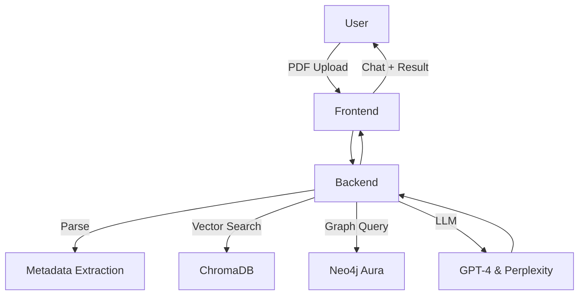

# 🧠 RefNavi: A Smart Academic Paper Reading Assistant

> “One paper, all the context”

### 한양대학교 25-1 [딥러닝및응용] 수업 프로젝트
데이터사이언스전공 양성민 (yangsp704@hanyang.ac.kr), 황지빈 (hjb7165@hanyang.ac.kr)

RefNavi는 사용자가 업로드한 논문 PDF에서 **reference 정보를 자동 추출하고**, 각 reference 논문의 핵심 메타데이터 및 인용 관계를 분석하여 **LLM 기반 질의응답**을 가능하게 하는 논문 보조 AI 시스템입니다.  
논문을 읽을때 참고문헌 목록이 논문 전체 페이지에서 은근히 많은 부분을 차지하는데, 하나의 논문을 읽어도 참고문헌 정보들을 통해 '풍부하게 읽도록' 하고자하는 목표로 프로젝트를 시작하였습니다.
<br>VectorRAG + GraphRAG을 결합하여 **신뢰도 높은 응답**을 제공합니다.

---

## 🔍 주요 기능 (Main Features)

- 📄 PDF 업로드 후 reference 메타데이터 자동 추출
- 📊 연도, 인용수 기반 reference 정렬
- 🧠 LLM 기반 논문 질의응답 (VectorRAG + GraphRAG)
- 🧭 Reference 관계 기반 citation intent 분석
- 💬 질문에 따라 hybrid retrieval 사용 (graph 우선, fallback vector)

---

## 🧱 시스템 구조 (System Architecture)




- 📄 PDF Parser: `pdfplumber` + Regex + GPT-4
- 📦 Metadata Caching: `integrated_metadata.json`
- 🔍 Similarity Search: Chroma + `all-MiniLM-L6-v2`
- 🧭 Citation Relation: LLM-based classification → Cypher → Neo4j
- 💬 QA: `GraphCypherQAChain`, `RetrievalQA`

---

## 🛠️ 설치 및 실행 (Installation)

```bash
git clone https://github.com/Jibinhwang/RefNavi.git
cd RefNavi
python -m venv venv
source venv/bin/activate

pip install -r requirements.txt
cd backend
uvicorn main:app --reload
cd frontend
npm run dev
```

---

## 📚 사용 예시 (Usage)

1. PDF 업로드
2. Reference 및 원논문 메타데이터 자동 추출
3. 레퍼런스 번호 클릭 시 Reference 간 관계 분석
4. 질의응답 예시:
    - “이 논문은 어떤 연구의 배경을 기반으로 하나요?”
    - “Transformer 논문에서 어떤 기술을 새롭게 제안했나요?”

---

## ⚙️ 기술 하이라이트 (Highlights)

- **Hybrid Retrieval (Vector + Graph)**
  - vector에서 context relevance 보완
  - graph에서는 citation purpose 기반 정확한 응답
- **LLM Prompt Engineering**
  - Few-shot 기반 citation intent classifier
  - context-aware QA generation
- **Chat Memory 문제 해결**
  - `ConversationBufferMemory` 대신 직접 chat history 삽입
---

## 🐞 트러블슈팅 사례 요약

| 문제 | 해결책 |
|------|--------|
| GraphCypherQAChain이 잘못된 Cypher 생성 | Few-shot 예시 및 명확한 프롬프트 룰 명시 |
| Chat memory 불안정 | LangChain default memory 대신 chat history 직접 삽입 |
| PDF 정규식 분석 오류 | LLM을 활용해 보정 |
| API rate limit | fallback 구조 사용 |
| 메타데이터 재생성 시간 소요 | 파일 존재 시 재생성 스킵 및 캐싱 처리 |

---

## 🔗 GitHub

👉 https://github.com/Jibinhwang/RefNavi

---
